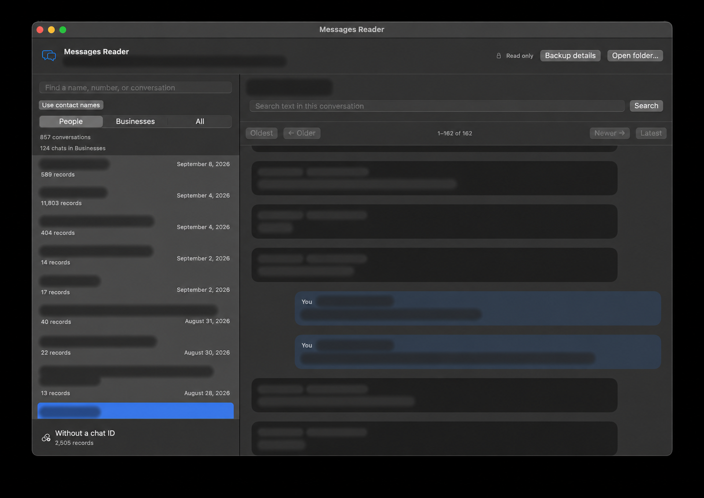
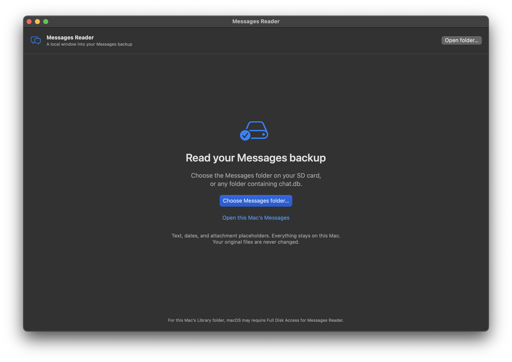
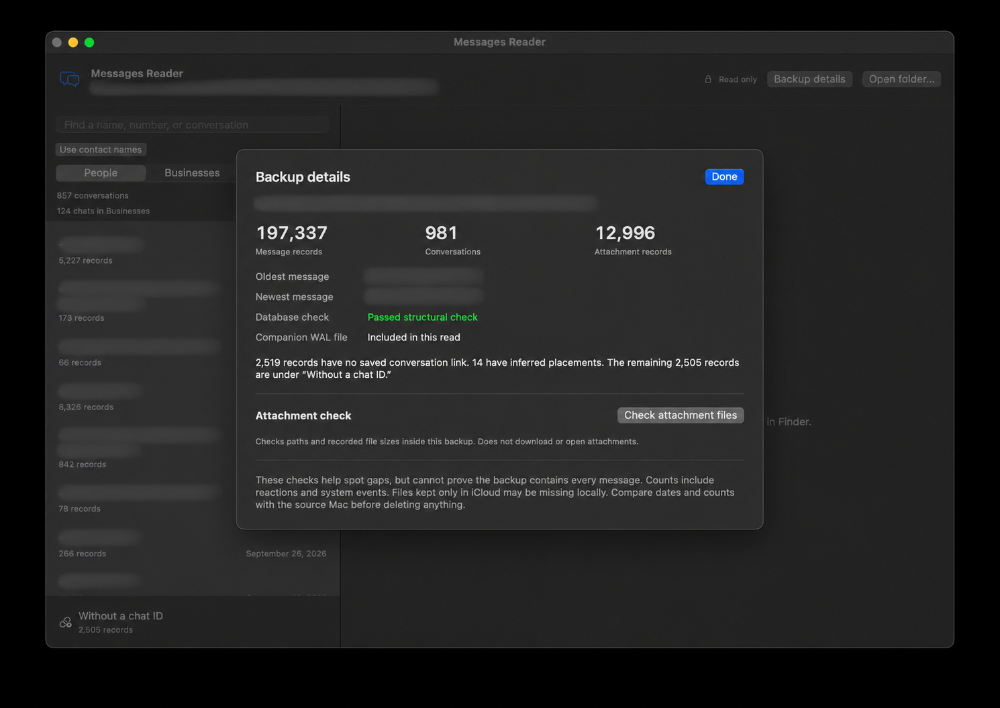

# iMessage Backup Reader

A small, offline Mac app for browsing Messages backups on an SD card or external drive. Read conversations, open attachments, and check your backup. Your original files stay unchanged.

## Download

**[Download the latest release](https://github.com/ashxkim/iMessage-Backup-Reader/releases/latest)** — macOS 13 or later. **No Xcode required.**

Choose **arm64** for Apple Silicon (M-series) or **x86_64** for Intel. Unzip the download and open **Messages Reader.app**. Choose an app ZIP from the release assets; GitHub’s “Source code” downloads are for developers.

The app is not Apple-notarized yet. If macOS blocks it, follow [Apple’s Open Anyway instructions](https://support.apple.com/en-us/102445).

## Screenshots

Welcome screen and backup details

| Choose a backup | Check backup details |
| --- | --- |
|  |  |

*Personal information is obscured in these screenshots.*

## Get started

1. **Make a backup.** Follow the [backup guide](docs/backup-guide.md) to copy your entire `~/Library/Messages` folder, including attachments and database companion files.
2. **Open it.** Click **Choose Messages folder…** and select your copied folder.
3. **Check it.** Open **Backup details**, run **Check attachment files**, and browse a few conversations.

The reader checks what is stored locally. It cannot download iCloud-only messages or attachments, and passing its checks does not prove a backup is complete.

## What you can do

- Browse and search conversations, with optional names from your Mac’s Contacts.
- Preview attachments and reveal their files in Finder.
- Keep suspected business senders in a separate tab.
- Inspect records without a chat ID, with collapsible events and clearly labeled inferred placements.

Everything runs locally, with no uploads or analytics.

## Guides

- **[Back up your Messages](docs/backup-guide.md)** — copying, permissions, and verifying your backup.
- **[Using the app](docs/user-guide.md)** — browsing, attachments, unassigned records, privacy, and limitations.
- **[Build and contribute](CONTRIBUTING.md)** — source builds, tests, and release packaging.

[MIT licensed](LICENSE). Independent project; not affiliated with Apple. iMessage is a trademark of Apple Inc.
